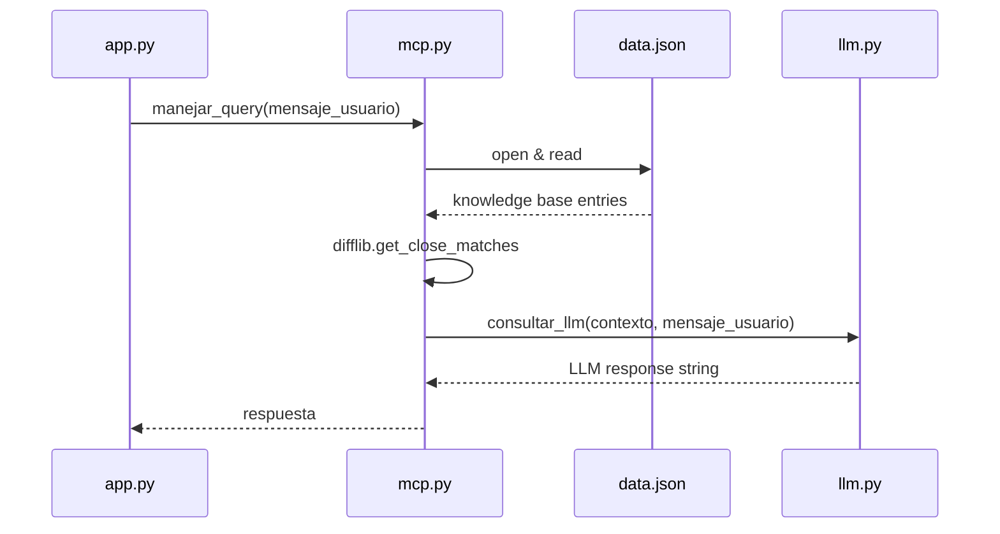

`mcp.py` is Yoko's **Message Context Processor**. It sits between the webhook layer (`app.py`) and the language model layer (`llm.py`), responsible for two things:

1. **Context retrieval** — finding the most relevant answer in `data.json` for a given question.
2. **Query orchestration** — combining that context with the user's message and passing both to the LLM.

## How context retrieval works

`buscar_contexto` uses Python's built-in `difflib.get_close_matches` to perform fuzzy string matching between the incoming question and every `pregunta` key in `data.json`. If the closest match meets the similarity threshold (`cutoff=0.4`), the corresponding `respuesta` is returned as context for the LLM.

```json data.json structure
[
  {
    "pregunta": "¿Cuándo son las inscripciones?",
    "respuesta": "Las inscripciones abren el 15 de febrero y cierran el 28 de febrero."
  },
  {
    "pregunta": "¿Dónde queda la biblioteca?",
    "respuesta": "La biblioteca central está en el edificio A, planta baja."
  }
]
```

## Functions

### buscar_contexto(pregunta_usuario)

Searches `data.json` for the question most similar to `pregunta_usuario` and returns its stored answer.

<ParamField path="pregunta_usuario" type="string" required>
  The incoming question text as received from the WhatsApp message. Used directly as the query for fuzzy matching.
</ParamField>

**Return value**

<ResponseField name="respuesta" type="string">
  The stored answer from `data.json` that corresponds to the closest matching question. Returns `"No se encontró información relevante."` if no question meets the similarity threshold.
</ResponseField>

**Fuzzy matching details**

`difflib.get_close_matches` is called with `n=1, cutoff=0.4`:

| Parameter | Value | Meaning |
|-----------|-------|---------|
| `n` | `1` | Return at most one match |
| `cutoff` | `0.4` | Minimum similarity ratio (0.0–1.0) to qualify as a match |

A cutoff of `0.4` means the incoming question must be at least 40% similar (by character sequence) to a stored question. Lower values increase recall but may return irrelevant matches; higher values increase precision but may miss valid questions.

```python mcp.py
def buscar_contexto(pregunta_usuario):
    with open("data.json", "r", encoding="utf-8") as f:
        base = json.load(f)

    preguntas = [item["pregunta"] for item in base]
    mas_parecida = difflib.get_close_matches(pregunta_usuario, preguntas, n=1, cutoff=0.4)

    if mas_parecida:
        for item in base:
            if item["pregunta"] == mas_parecida[0]:
                return item["respuesta"]

    return "No se encontró información relevante."
```

<Note>
  `data.json` is read from disk on every call. For high-traffic deployments, consider loading it once at startup and caching it in memory.
</Note>

---

### manejar_query(mensaje_usuario)

Top-level orchestrator. Calls `buscar_contexto` to retrieve relevant context, then passes both the context and the original message to `consultar_llm` and returns the final response.

This is the only function called from `app.py`.

<ParamField path="mensaje_usuario" type="string" required>
  The raw message text received from the WhatsApp user, as extracted from the webhook payload.
</ParamField>

**Return value**

<ResponseField name="respuesta" type="string">
  The final response string generated by the LLM. This is passed directly to `enviar_mensaje` in `app.py` and sent to the user.
</ResponseField>

```python mcp.py
def manejar_query(mensaje_usuario):
    contexto = buscar_contexto(mensaje_usuario)
    respuesta = consultar_llm(contexto, mensaje_usuario)
    return respuesta
```

## Call flow


